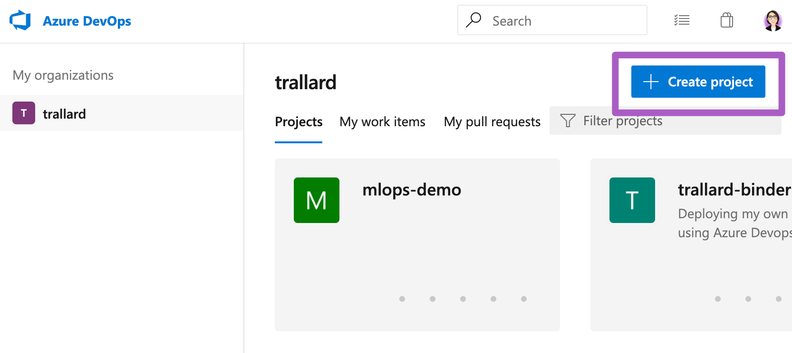
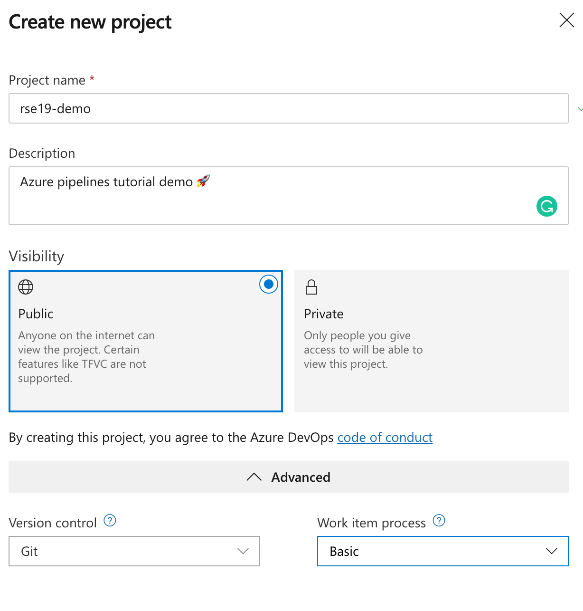

# Introduction to Azure Pipelines

You can use Azure pipelines to test and build your Python (or any other language) projects without needing to set up any insfrastructure of your own. For this tutorial we will use the [Microsoft-hosted agents](https://docs.microsoft.com/azure/devops/pipelines/agents/hosted?view=azure-devops&WT.mc_id=rse19-github-taallard) with Python preinstalled - note that these can be Windows, Linux or macOS based.

## Setting things up

1. Head over to [Azure DevOps](https://azure.microsoft.com/services/devops/?WT.mc_id=rse19-github-taallard) click on Start for free (note you can directly link to your GitHub account).
2. Once registered you need to create an organisation for your products. This will allow you to work with your collaborators in multiple shared-projects.

When prompted to choose the location for your projects make sure to choose a close by region to you. For example, for this workshop we could use WestEurope.
3. Once completed you can sign into your organisation at any time through ``http://dev.azure.com/{your_org}``.
4. We now need to create a new project. Click on the **+ Create project** button 

Make sure to give your project a meaningful name and add a sensible description.

Then click on **Create**

## Understanding the Azure Pipeline Build

A build can have multiple stages. Each stage represent a specific set of tasks within the main pipeline. For example you might have the following jobs:
- Test (my code using unittest)
- Build (my awesome app)
- Deploy (to pre-production)

You can find a list of all the available tasks in the [Pipelines documentation](https://docs.microsoft.com/azure/devops/pipelines/tasks/?view=azure-devops&viewFallbackFrom=vsts&WT.mc_id=rse19-github-taallard). Plus you can define your own tasks using bash or PowerShell.

Let's start by creating our `azure-pipelines.yml` 