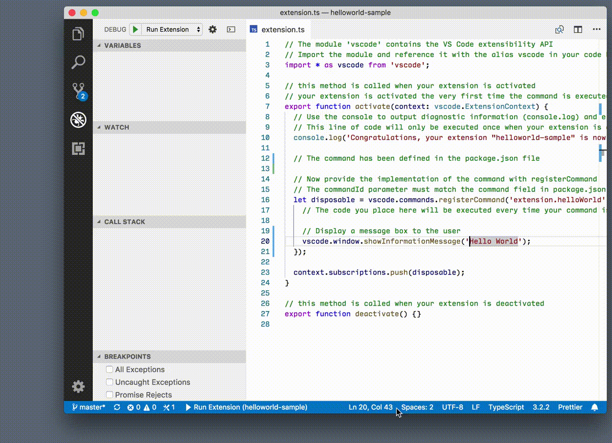
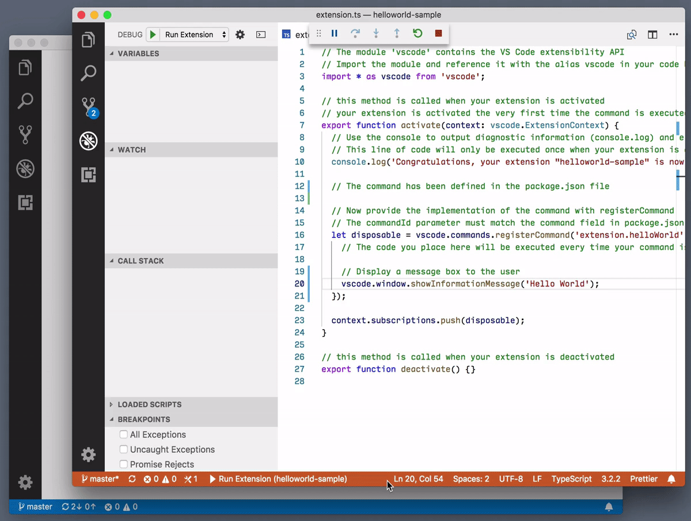
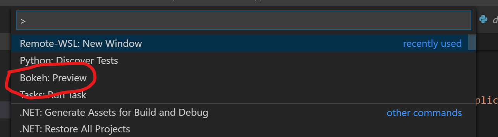
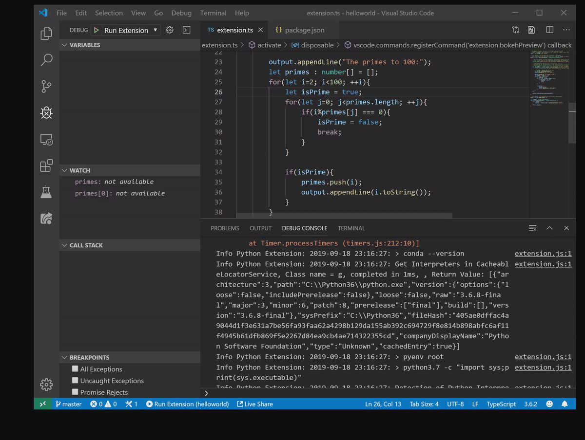
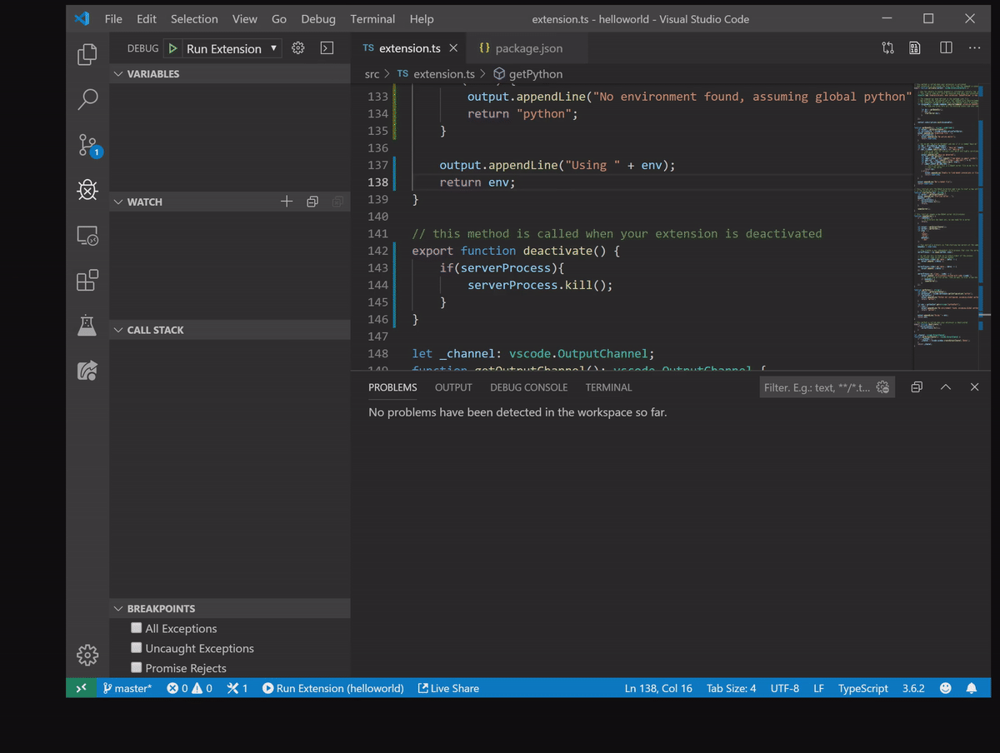
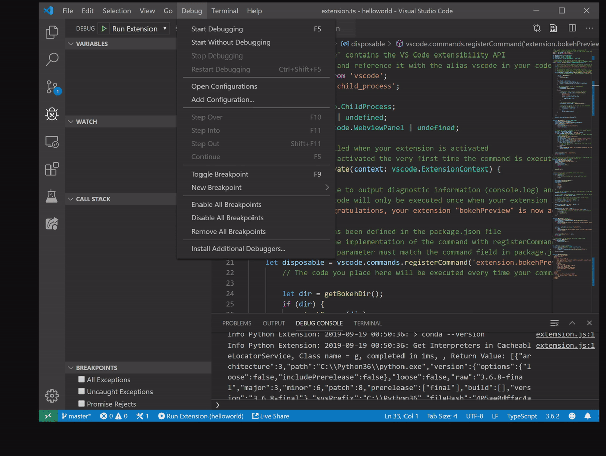

# Building a VS Code Extension

VS Code is designed from the ground up to be easy to modify, augment and 
change. Almost every aspect of the editor is up for grabs, and indeed the
language support, debugging tools, syntax highlighting and everything else
that exists is implemented in the same framework that is exposed to
third party developers. In this tutorial, we will cover some of the basic
ways in which you can extend VS Code, but extensions are able to do so
much more:

- [Theming](https://code.visualstudio.com/api/extension-capabilities/theming): Change the look of VS Code with a color or icon theme
- [Extend the Workbench](https://code.visualstudio.com/api/extension-capabilities/extending-workbench): Add custom components & views in the UI
- [Custom Webviews](https://code.visualstudio.com/api/extension-guides/webview): Create a Webview to display a custom webpage built with HTML/CSS/JS
- [Languages](https://code.visualstudio.com/api/language-extensions/overview): Support a new programming language
- [Debugging](https://code.visualstudio.com/api/extension-guides/debugger-extension): Support debugging a specific runtime

There is much more to learn than can be covered in this short tutorial, so
if you are interested you should take a look at the resources available
at the [main VS Code documentation](https://code.visualstudio.com/api).
Much of this material is to be found in deeper detail there.

## Getting Started

Starting a new Extension project is straightforward. You will need to have
installed [Node.js](https://nodejs.org/en/) so you can run this command:

```
npm install -g yo generator-code
```

This will install [Yeoman](http://yeoman.io/) and [VS Code Extension Generator](https://www.npmjs.com/package/generator-code). You can use these to quickly set up a new Extension
project using an interactive command line tool:

```bash
yo code

# ? What type of extension do you want to create? New Extension (TypeScript)
# ? What's the name of your extension? HelloWorld
### Press <Enter> to choose default for all options below ###

# ? What's the identifier of your extension? helloworld
# ? What's the description of your extension? LEAVE BLANK
# ? Initialize a git repository? Yes
# ? Which package manager to use? npm

code ./helloworld
```

If you use the prompts shown above, you will create a HelloWorld
extension project which we can modify to add further functionality.
The last line will open up VS Code in the extension directory.
As you might expect, VS Code is able to provide lots of useful
tools to help you create your extension.

## Creating a Command

The automatic tool has created a fully-functioning extension that
we can test. Either select "Debug->Start Debugging" or press
"F5", and VS Code will open up another instance of itself in
debug mode with your Extension code installed, allowing you to
step through your code in the main (host) instance while playing
with the extension in the (test) instance.



The automatic project that has been created for you implements the
most straightforward kind of extension: a new command. The VS Code
command palette can be evoked by `CTRL+SHIFT+P` on Windows/Linux or
`SHIFT+⌘+P` on Mac, and brings up a list of commands supported by
VS Code for the current editor state. By implementing a custom
command extension, you can add a new command to this list. Let's look
at how we do that.

Extensions in VS Code are implemented in [Typescript](https://www.typescriptlang.org/),
a typed language which transpiles to Javascript. First, however,
we define in `project.json` what kind of extension we are building
and what it contributes to VS Code:

```javascript
{
  "name": "helloworld-sample",
  "displayName": "helloworld-sample",
  "description": "HelloWorld example for VS Code",
  "version": "0.0.1",
  "publisher": "vscode-samples",
  "repository": "https://github.com/Microsoft/vscode-extension-samples/helloworld-sample",
  "engines": {
    "vscode": "^1.34.0"
  },
  "categories": ["Other"],
  "activationEvents": ["onCommand:extension.helloWorld"],
  "main": "./out/extension.js",
  "contributes": {
    "commands": [
      {
        "command": "extension.helloWorld",
        "title": "Hello World"
      }
    ]
  },
  "scripts": {
    "vscode:prepublish": "npm run compile",
    "compile": "tsc -p ./",
    "watch": "tsc -watch -p ./",
    "postinstall": "node ./node_modules/vscode/bin/install"
  },
  "devDependencies": {
    "@types/node": "^8.10.25",
    "@types/vscode": "^1.34.0",
    "tslint": "^5.16.0",
    "typescript": "^3.4.5"
  }
}
```

The file created by the tool should look something much like this. The most
important part of this file is the snippet below:

```javascript
  "activationEvents": ["onCommand:extension.helloWorld"],
  "main": "./out/extension.js",
  "contributes": {
    "commands": [
      {
        "command": "extension.helloWorld",
        "title": "Hello World"
      }
    ]
  },
```

We first indicate an [activation event](https://code.visualstudio.com/api/references/activation-events)
which tells VS Code when our code should be called. In this case, we want our
code called when the user selects our command. We then say where our extension
code lives (`./out/extension.js` is the executable code produced by our
typescript code). Finally, we tell VS Code what we our extension contributes,
which in this case is a new command. It has a unique name
(`extension.helloWorld`) but also a readable title, which will appear in the
command palette.

Now that we have told VS Code what our extension is and where to find
our code, we can provide our custom functionality. `src/extension.ts` contains
the automatically generated extension code we just ran:

```typescript
// The module 'vscode' contains the VS Code extensibility API
// Import the module and reference it with the alias vscode in your code below
import * as vscode from 'vscode';

// this function is called when your extension is activated
// your extension is activated the very first time the command is executed
export function activate(context: vscode.ExtensionContext) {

	// Use the console to output diagnostic information (console.log) and errors (console.error)
	// This line of code will only be executed once when your extension is activated
	console.log('Congratulations, your extension "helloworld" is now active!');

	// The command has been defined in the package.json file
	// Now provide the implementation of the command with registerCommand
	// The commandId parameter must match the command field in package.json
	let disposable = vscode.commands.registerCommand('extension.helloWorld', () => {
		// The code you place here will be executed every time your command is executed

		// Display a message box to the user
		vscode.window.showInformationMessage('Hello World!');
	});

	context.subscriptions.push(disposable);
}

// this function is called when your extension is deactivated
export function deactivate() {}
```

The code in `activate` is called when the activation event we've specified
first fires. In this function, we register our new command by giving it a name 
(`extension.helloWorld`, matching the name we gave in `project.json`) and
providing a lambda function which will be called whenever the command is
triggered. In this case, we've popped up a quick information box saying
`Hello World!`. Let's change this to be `Hello VS Code!` and then reload
the extension:



If you want, you can place a breakpoint in the function and debug your
extension directly. Your command can do any number of interesting
tasks, and has access to the state of the whole editor through
the rich [VS Code Extension API](https://code.visualstudio.com/api/references/vscode-api).

## Using Custom Output

In the rest of this tutorial, we will focus on recreating a particular extension
that we have developed for this repo. There are two [Bokeh](https://bokeh.pydata.org/en/latest/)
interactive websites that provide tools for exploring the [Iris](https://en.wikipedia.org/wiki/Iris_flower_data_set)
and [Boston](https://www.cs.toronto.edu/~delve/data/boston/bostonDetail.html)
datasets. While we can use the built-in terminal to start up the Bokeh server:

```bash
python -m bokeh serve iris
```

It would be very interesting if we could get a live preview of the
website as we develop it from inside of VS Code, similar to the Markdown
preview functionality (which is itself a default extension!). To start, 
let's find a better way of communicating with the user.

While showing text as a popup message is a fine way of communicating, 
it is not particularly effective for providing helpful,
longer-term communication between our extension and the user.
One particularly useful functionality to which our Extension has access
is the ability to create custom output windows, which act like
read-only consoles that present information sequentially, allowing the
user to scroll back, click links, and copy and paste information.

First things first, we are going to rebrand our extension:

```javascript
  "name": "bokehpreview",
  "displayName": "BokehPreview",
  //...
  "activationEvents": ["onCommand:extension.bokehPreview"],
  "main": "./out/extension.js",
  "contributes": {
    "commands": [
      {
        "command": "extension.bokehPreview",
        "title": "Preview",
        "category": "Bokeh"
      }
    ]
  },
```

By adding a category, we allow VS Code to helpfully group any other
Bokeh related commands we may add later. In the UI, it will show up
as `Bokeh: Preview`:



Now let's add the following code to `src/extension.ts`:

```typescript
// this function creates our own private output channel
let _channel: vscode.OutputChannel;
function getOutputChannel(): vscode.OutputChannel {
	if (!_channel) {
		_channel = vscode.window.createOutputChannel('Bokeh');
	}
	return _channel;
}
```

This code either returns an existing channel, or creates a new one
that will be shown in the Output drop down with the label "Bokeh".
Next, we can write to this output by appending lines. Try adding
the following code to your command callback:

```typescript
let output = getOutputChannel();
output.appendLine("Hello VS Code!");

output.appendLine("The primes to 100:");
let primes : number[] = [];
for(let i=2; i<100; ++i){
    let isPrime = true;
    for(let j=0; j<primes.length; ++j){
        if(i%primes[j] === 0){
            isPrime = false;
            break;
        }
    }

    if(isPrime){
        primes.push(i);
        output.appendLine(i.toString());
    }
}
```

Now, let's debug and run it:



Now that we have our own communication channel, let's look at how to 
run the Bokeh server.

## Child Processes

Ultimately, we need a way of programmatically spawning a child process
that will run the Bokeh server for us. Thankfully, we have full access to
Node's
[Child Process](https://nodejs.org/api/child_process.html) API. 

To spawn a child process that runs Bokeh, we need to do a few things:

1. Find out what version of Python the user is running
2. Figure out if the current file is actually a Bokeh site
3. Spawn a server process

Let's look at how we can use the rich suite of workspace introspection
tools that VS Code gives us to achieve that.

### Interacting with Other Extensions

In order to find out what version of Python (or Python virtual
environment) the user has configured for a project, we need to
access the place that information is stored, namely, the configuration
of the Python language extension. Thankfully, VS Code exposes this information
to our extension via the configuration namespace:

```typescript
let pythonConf = vscode.workspace.getConfiguration("python");
if (!pythonConf) {
  output.appendLine("Python not configured, assuming global python");
  return "python";
}
```

We can actually ask the workspace for the configuration for the python
extension directly. If we cannot find one, we'll default to assuming that
`python` is a valid command for the system (i.e. on the PATH). However,
if there is a configuration, we can ask it how the user has configured
the Python extension:

```typescript
let env = pythonConf.get<string>("pythonPath");
if (!env) {
  output.appendLine("No environment found, assuming global python");
  return "python";
}
```

Again, if there is not an environment, we default back to simply `python`.
This kind of interaction is key to enabling interoperability between
extensions. Let's put it together into a single function:

```typescript
function getPython(): string {
	let output = getOutputChannel();
	let pythonConf = vscode.workspace.getConfiguration("python");
	if (!pythonConf) {
		output.appendLine("Python not configured, assuming global python");
		return "python";
	}

	let env = pythonConf.get<string>("pythonPath");
	if (!env) {
		output.appendLine("No environment found, assuming global python");
		return "python";
	}

	output.appendLine("Using " + env);
	return env;
}
```

### Learning About the Current File

VS Code provides us full access to the state of the current editor, including
the current file the user is looking at. What we want to do now is see whether
it is likely to be a Bokeh server definition. First, we get a reference to the
current active editor and its document:

```typescript
let activeEditor = vscode.window.activeTextEditor;
output.appendLine("Examining file...");
if (!activeEditor) {
  output.appendLine("No active editor");
  return;
}

// now we get the active document and see if it is named "main.py"
let doc = activeEditor.document;
let start = doc.fileName.length - "main.py".length;
if (doc.fileName.substring(start) === "main.py") {
  // finally we look for certain lines which are highly correlated
  // with Bokeh usage
  output.appendLine("main.py detected");
```

We first get the active editor, and then query its open document. We then
check that the name of that document ends in `main.py`, indicating this
could be a Bokeh server file. We can access many different properties of
the document in this way. Next, we find out some information about
the contents of the file:

```typescript
		// finally we look for certain lines which are highly correlated
		// with Bokeh usage
		output.appendLine("main.py detected");
		let text = doc.getText();
		let import_bokeh = text.indexOf("from bokeh.io import curdoc") >= 0;
		let add_root = text.indexOf("curdoc().add_root(") >= 0;
		let dir = doc.fileName.substring(0, start);
```

Chances are that any file named `main.py` with the text
`from bokeh.io import curdoc` and `curdoc().add_root(` is a Bokeh server,
so we can fairly confidently return the directory. The full function is
below:

```typescript
function getBokehDir(): string | undefined {
	let output = getOutputChannel();
	let activeEditor = vscode.window.activeTextEditor;
	output.appendLine("Examining file...");
	if (!activeEditor) {
		output.appendLine("No active editor");
		return undefined;
	}

	// now we get the active document and see if it is named "main.py"
	let doc = activeEditor.document;
	let start = doc.fileName.length - "main.py".length;
	if (doc.fileName.substring(start) === "main.py") {
		// finally we look for certain lines which are highly correlated
		// with Bokeh usage
		output.appendLine("main.py detected");
		let text = doc.getText();
		let import_bokeh = text.indexOf("from bokeh.io import curdoc") >= 0;
		let add_root = text.indexOf("curdoc().add_root(") >= 0;
		let dir = doc.fileName.substring(0, start);
		if (import_bokeh && add_root) {
			// fairly certain this is a Bokeh server file so we try to
			// start the server
			return dir;
		} else {
			output.appendLine("Unable to find bokeh invocations in file");
			return undefined;
		}
	}

	output.appendLine("Not a bokeh file");
	return undefined;
}
```

### Spawn a new server

Now that we have the directory to serve the Bokeh file and the current Python
executable path, we can start up our server process.

```typescript
import * as cp from 'child_process';
let serverProcess: cp.ChildProcess;

// ...

let args = [
  "-m",
  "bokeh",
  "serve",
  bokehDir,
  "--dev"
];

// this partially protects us from starting two servers at the same time
bokehDir = undefined;

// this creates a new independent child process that runs the server
serverProcess = cp.spawn(python, args);

// we can use this to hook up to stdout/stderr of the process
// and output them to our custom channel
serverProcess.stdout.on('data', (data) => {
  output.append(`${data}`);
});

serverProcess.stderr.on('data', (data) => {
  output.append(`${data}`);
});
```

One great aspect of the child process module is that we can attach to
the pipes of the process. In our case, we can redirect them to our
output channel, allowing the user to see the output from the process
directly inside of VS Code. However, we need to be careful. If the
user runs the command twice, this will create a second server, which
will likely fail due to a port conflict. We need to kill the existing
server, and then (once it has died) start up a new server. To do this,
we need some additional work. We can see the full system below:

```typescript
let bokehDir: string | undefined;
// ...

// this function sets the Bokeh directory and tries to start a new server.
// if the existing server is running, it kills it.
function startServer(dir: string) {
	let output = getOutputChannel();
	output.appendLine("Starting server...");
	bokehDir = dir;
	if (serverProcess) {
		serverProcess.kill();
		return;
	}

	spawnServer();
}

// this function spawns a new Bokeh server child process
function spawnServer() {
	if (!bokehDir) {
		// no directory has been set, so new need for a server
		return;
	}

	let output = getOutputChannel();
	let python = getPython();
	let args = [
		"-m",
		"bokeh",
		"serve",
		bokehDir,
		"--dev"
	];

	// this partially protects us from starting two servers at the same time
	bokehDir = undefined;

	serverProcess = cp.spawn(python, args);
	serverProcess.stdout.on('data', (data) => {
		output.append(`${data}`);
	});
	serverProcess.stderr.on('data', (data) => {
		output.append(`${data}`);
	});

	serverProcess.on('close', (code) => {
		output.append(`child process exited with code ${code}`);
		// if we killed an old server, then we want to start a new one
		if (bokehDir) {
			spawnServer();
		}
	});
}

// this function is called when your extension is deactivated
export function deactivate() {
	if(serverProcess){
		serverProcess.kill();
	}
}
```

Let's see how this works together:




## Custom Menus

Another cool thing we can do with VS Code extensions is change the GUI of
the workbench, adding menus, buttons and icons. For this extension, it
makes sense to add a menu button to the title bar. First, we need
some icons:

|        Name       |                   Icon                    |
|-------------------|-------------------------------------------|
| Preview Light     |  |
| Preview Dark Icon |    |


The two versions of this SVG will allow us to support light and dark themes.
We can then update the `package.json` to set icons for our command:

```javascript
		"commands": [
			{
				"command": "extension.bokehPreview",
				"title": "Preview",
				"category": "Bokeh",
				"icon": {
					"light": "media/preview_light.svg",
					"dark": "media/preview_dark.svg"
				}
			}
		],
```

Finally, we let VS Code know that this extension also contributes a menu
item:

```javascript
"menus": {
  "editor/title": [
    {
    "when": "resourceFilename == main.py",
    "command": "extension.bokehPreview",
    "group": "navigation"
    }
  ]
}
```

There are some interesting aspects here. First, we limit the when the icon
will be displayed using a [when clause construct](https://code.visualstudio.com/docs/getstarted/keybindings#_when-clause-contexts). These are very powerful, allowing
functionality to be turned on based upon various editor contexts, such as
a file being detected as a particular language or the system being in debug
mode. The result is a fun icon which, when clicked, will call our extension:


## WebView

Perhaps the most powerful element to add to an extension (barring language
extensions or full debuggers) is a custom Webview UI element. This is a
full HTML/JS/CSS webpage that runs inside of VS Code. Typically, this
should be avoided unless absolutely necessary, and given the wide array
of things VS Code exposes to via the VS Code API it is rarely needed, but
sometimes only a custom WebView will do.

Luckily for us, this is one of those times! We want to show a preview
window inside of the editor that displays the page that is being hosted
by our Bokeh server. When we create the command, we can also create
the preview panel and add it to the VS Code workbench. First, we need
to find out what column of the workbench to use:

```typescript
let column = undefined;
if (vscode.window.activeTextEditor) {
  column = vscode.window.activeTextEditor.viewColumn;
}
```

Now, let's create the preview window:

```typescript
let previewPanel: vscode.WebviewPanel | undefined;
// ...

// the preview panel lives as a tab in the editor
previewPanel = vscode.window.createWebviewPanel(
  'bokehPreview',
  'Bokeh Preview',
  column || vscode.ViewColumn.One,
  {
    enableScripts: true
  }
);

// we can set its HTML directly
previewPanel.webview.html = getWebviewContent();
```

`getWebviewContent` creates a simple webpage as a string which
uses an `iframe` to host the website:

```typescript
function getWebviewContent() {
	return `<!DOCTYPE html>
  <html lang="en">
  <head>
	  <meta charset="UTF-8">
	  <meta name="viewport" content="width=device-width, initial-scale=1.0">
	  <title>Bokeh Preview</title>
	  <style>
	  iframe {
		position:fixed;
		top:0; left:0; bottom:0; right:0;
		width:100%; height:100%;
		border:none; margin:0; padding:0;
		overflow:hidden; z-index:999999;
	  }
	  </style>
  </head>
  <body>
  	<iframe src="http://localhost:5006/">
		Your browser doesn't support iframes
	</iframe>
  </body>
  </html>`;
}
```

However, what happens when the user runs our command a second time? We
probably don't want to create a second preview window. Instead, let's
check if we've already created one and just bring it back to the foreground:

```typescript
if (previewPanel) {
  previewPanel.reveal(column);
}
```

One last thing: what if the user closes the window? Our reference would
then point at a dead UI element. VS Code enables us to deal with this
eventuality using an event callback:

```typescript
previewPanel.onDidDispose(() => {
  previewPanel = undefined;
},
  null,
  context.subscriptions);
```

And that is it! Let's see the whole extension in operation:

